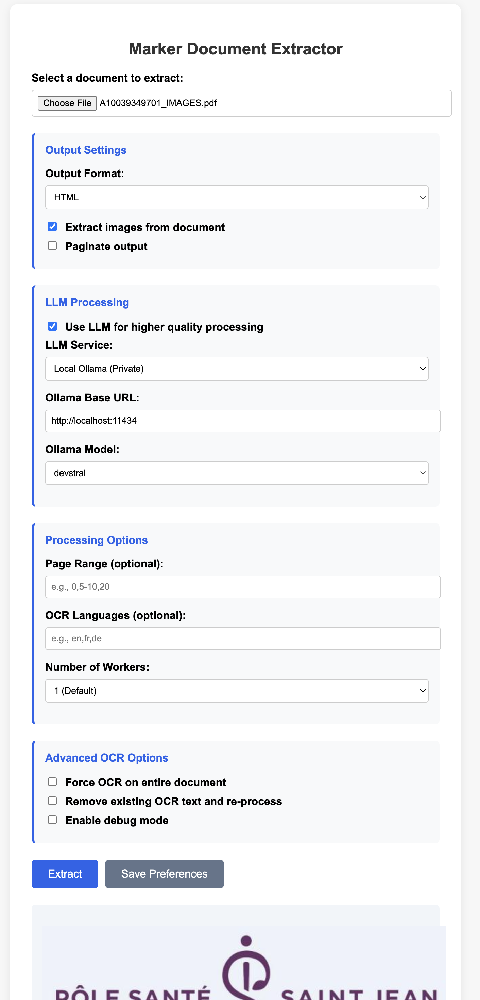

# Marker Document Extractor

A web-based document extraction tool that converts various document formats (PDF, Images, PPTX, DOCX, XLSX, HTML, EPUB) to structured formats (JSON, Markdown, HTML) using the powerful [Marker](https://github.com/VikParuchuri/marker) library. The application features a modern web interface with support for LLM-enhanced processing via Google Gemini or local Ollama models.

## 📸 Screenshot



*The clean, modern web interface with comprehensive extraction options*

## 🚀 Features

- **Universal Document Support**: Convert PDF, Images (PNG, JPG, GIF, BMP, TIFF), PowerPoint (PPTX), Word (DOCX), Excel (XLSX), HTML, and EPUB files
- **Multiple Output Formats**: Convert documents to JSON, Markdown, or HTML with proper format selection
- **LLM Processing**: Enhanced extraction using Google Gemini or local Ollama models
- **Image Extraction**: Automatically extract and serve images from documents
- **Advanced Options**: Page range selection, OCR control, multi-language support
- **User Preferences**: Save and load extraction preferences with functional Save Configuration button
- **Real-time Processing**: Live status updates during document processing using Server-Sent Events (SSE)
- **Modern UI**: Clean, responsive web interface with proper format display
- **GPU Acceleration**: Automatic detection and use of MPS (Metal Performance Shaders) on macOS

## 📋 Prerequisites

Before installing, ensure you have:

- Python 3.8 or higher
- [Marker](https://github.com/VikParuchuri/marker) library installed
- (Optional) [Ollama](https://ollama.ai/) for local LLM processing
- (Optional) Google API key for Gemini processing

## 🛠️ Installation

### 1. Clone the Repository

```bash
git clone https://github.com/zorgy28/marker-document-extractor.git
cd marker-document-extractor
```

### 2. Create Virtual Environment

```bash
python -m venv venv
source venv/bin/activate  # On Windows: venv\Scripts\activate
```

### 3. Install Dependencies

```bash
pip install -r requirements.txt
```

This will automatically install `marker-pdf[full]` which includes all dependencies for:
- **PDF processing**: Built-in support
- **Document conversion**: `mammoth` for DOCX, `weasyprint` for HTML rendering
- **Spreadsheets**: `openpyxl` for Excel files
- **Presentations**: `python-pptx` for PowerPoint files
- **E-books**: `ebooklib` for EPUB files
- **Images**: Built-in support via Pillow and OCR

### 4. Configure Environment

Create a `.env` file in the project root:

```bash
cp .env.example .env
```

Edit `.env` and add your API keys:

```env
# Google API Key for Marker LLM processing
# Get your API key from: https://makersuite.google.com/app/apikey
GOOGLE_API_KEY=your_google_api_key_here
```

### 5. (Optional) Install and Configure Ollama

For local LLM processing:

1. Install Ollama from [https://ollama.ai/](https://ollama.ai/)
2. Pull a compatible model:
   ```bash
   ollama pull llama2
   # or
   ollama pull mistral
   # or
   ollama pull devstral
   ```

## 🚀 Usage

### 1. Starting the Application

Run the server:
```bash
python main.py
```

The application will be available at `http://localhost:8000`

### Using the Web Interface

1. **Upload Document**: Select any supported file to extract:
   - PDF documents
   - Images (PNG, JPG, GIF, BMP, TIFF)
   - Microsoft Office files (DOCX, PPTX, XLSX)
   - HTML files
   - EPUB ebooks
2. **Choose Output Format**: JSON, Markdown, or HTML
3. **Configure LLM** (optional):
   - Select Google Gemini or Ollama
   - For Ollama: Ensure it's running and select a model
   - For Gemini: Provide your API key
4. **Set Advanced Options**:
   - Extract images
   - Page range selection (for multi-page documents)
   - Language specification
   - Worker count for parallel processing
5. **Extract**: Click the Extract button to process your document

### API Endpoints

- `GET /` - Serve the web interface
- `POST /extract` - Extract document content
- `GET /images/{session_id}/{filename}` - Serve extracted images
- `GET /sessions` - List active sessions
- `DELETE /cleanup/{session_id}` - Clean up session data
- `GET /ollama/status` - Check Ollama status and models
- `GET /preferences` - Get saved preferences
- `POST /preferences` - Save user preferences

## 📁 Project Structure

```
marker-document-extractor/
├── main.py                 # FastAPI application
├── index.html             # Web interface
├── requirements.txt       # Python dependencies
├── .env                   # Environment variables
├── user_preferences.json  # Saved user preferences
├── extracted_images/      # Served image directory
└── README.md             # This file
```

## ⚙️ Configuration

### Environment Variables

- `GOOGLE_API_KEY`: Google Gemini API key for LLM processing
- `OLLAMA_KEEP_ALIVE`: How long to keep Ollama models loaded (default: 2h)
- `OLLAMA_MAX_LOADED_MODELS`: Maximum number of loaded models (default: 1)

### User Preferences

The application saves user preferences automatically, including:
- LLM service selection
- Model preferences
- Output format
- Processing options

## 🔧 Advanced Usage

### Command Line Parameters

The application supports all Marker command-line parameters:

- `--output_format`: Output format (json, markdown, html)
- `--use_llm`: Enable LLM processing
- `--page_range`: Specific page range (e.g., "1-5")
- `--languages`: Language codes for OCR (e.g., "en,es")
- `--workers`: Number of parallel workers
- `--force_ocr`: Force OCR even for text-based PDFs
- `--strip_existing_ocr`: Remove existing OCR before processing
- `--paginate_output`: Paginate the output
- `--debug`: Enable debug mode

### Ollama Configuration

For optimal performance with Ollama:

1. Increase memory allocation:
   ```bash
   export OLLAMA_KEEP_ALIVE=2h
   export OLLAMA_MAX_LOADED_MODELS=1
   ```

2. Use recommended models:
   - `llama2`: General purpose
   - `mistral`: Fast and accurate
   - `devstral`: Code-optimized

## 🐛 Troubleshooting

### Common Issues

1. **Marker not found**: Ensure Marker is properly installed
   ```bash
   pip install marker-pdf
   ```

2. **Ollama connection failed**: Check if Ollama is running
   ```bash
   ollama serve
   ```

3. **Google API errors**: Verify your API key in `.env`

4. **Memory issues**: Reduce worker count or use smaller models

### Debug Mode

Enable debug mode for detailed logging:
- Check the "Debug mode" option in the web interface
- Or set `debugMode: true` in your preferences

## 🤝 Contributing

1. Fork the repository
2. Create a feature branch: `git checkout -b feature-name`
3. Commit your changes: `git commit -am 'Add feature'`
4. Push to the branch: `git push origin feature-name`
5. Submit a pull request

## 📝 License

This project is licensed under the MIT License - see the [LICENSE](LICENSE) file for details.

## 🙏 Acknowledgments

- [Marker](https://github.com/VikParuchuri/marker) - The core document extraction library
- [FastAPI](https://fastapi.tiangolo.com/) - Modern web framework
- [Ollama](https://ollama.ai/) - Local LLM runtime

## 📞 Support

If you encounter any issues or have questions:

1. Check the [troubleshooting section](#-troubleshooting)
2. Review the [Marker documentation](https://github.com/VikParuchuri/marker)
3. Open an issue on GitHub

---

**Note**: This application requires the Marker library to be properly installed and configured. Please follow the [official Marker installation guide](https://github.com/VikParuchuri/marker#installation) for your specific system.

## 👨‍💻 Author

**Minh Cao**  
[](https://www.linkedin.com/in/minhc/)

## 📝 Version History

### Recent Fixes

#### v1.3.0 (Latest)

- **Universal File Format Support**: Extended support beyond PDFs to all Marker-compatible formats
  - Images: PNG, JPG/JPEG, GIF, BMP, TIFF with OCR support
  - Microsoft Office: DOCX, PPTX, XLSX files
  - Web Documents: HTML files
  - E-books: EPUB format
- **Enhanced UI**: Added detailed file type information and contextual help
- **Improved Processing**: Generic progress messages for all document types

#### v1.2.1

- **Fixed Output Format Bug**: Resolved issue where selecting Markdown or HTML format would incorrectly return JSON content
  - Enhanced file selection logic to properly match output format with file extensions (.md, .html, .json)
  - Added fallback mechanism when specific format files are not found
  - Improved debug logging for better troubleshooting
- **Restored Save Configuration**: Fixed the Save Configuration button functionality
- **Enhanced SSE Processing**: Improved Server-Sent Events handling for real-time progress updates
- **Better Error Handling**: Added comprehensive error messages and fallback options

### v1.2.0

- Enhanced LLM processing with improved model selection
- Added support for Server-Sent Events (SSE) for real-time updates
- Fixed issue with image extraction not serving images correctly
- Improved user preferences saving and loading

### v1.1.0

- Fixed issue with Save Configuration button not saving preferences
- Improved output format selection with proper format display
- Added support for GPU acceleration using MPS on macOS
- Updated dependencies to latest versions

### v1.0.0

- Initial release of the Marker Document Extractor
- Supports PDF to JSON, Markdown, and HTML conversion
- Includes LLM processing with Google Gemini and Ollama
- Features a modern web interface with real-time processing updates
